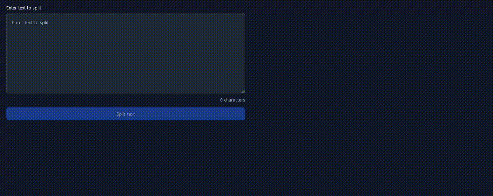

# xsplitter

[](https://opensource.org/licenses/MIT)
[](https://vuejs.org/)
[](https://nodejs.org)
[](https://www.typescriptlang.org/)

A modern web application for intelligently splitting long text into smaller, shareable chunks while preserving readability.



## Features

- 🎯 Smart text splitting between 200-280 characters
- 📝 Preserves sentence structure where possible
- 🔄 Custom split points using [SPLIT] delimiter
- 📋 One-click copy for each chunk
- 🕒 History of previous splits with previews
- 💾 Persistent storage of split history
- 🌙 Dark mode interface
- ⌨️ Fully keyboard accessible

## How it Works

xsplitter intelligently splits text using the following rules:
1. Splits text into chunks between 200-280 characters
2. Tries to maintain sentence integrity by:
   - Keeping sentences together when possible
   - Splitting at commas if needed
   - Only splitting mid-sentence as a last resort
3. Adds "(x/y)" suffixes to show chunk position
4. Allows manual split points using the [SPLIT] delimiter

## Browser Support

- Chrome (latest)
- Firefox (latest)
- Safari (latest)
- Edge (latest)

## Getting Started

### Prerequisites

- Node.js 20.x or higher
- npm

### IDE Setup

#### VSCode
[VSCode](https://code.visualstudio.com/) + [Volar](https://marketplace.visualstudio.com/items?itemName=Vue.volar) (and disable Vetur) is the recommended setup for this project.

For proper TypeScript support in `.vue` files, we use `vue-tsc` for type checking. The Volar extension makes the TypeScript language service aware of `.vue` types.

#### WebStorm
[WebStorm](https://www.jetbrains.com/webstorm/) has built-in support for Vue.js and TypeScript. To set up:

1. Open the project in WebStorm
2. Enable Vue.js support in Settings/Preferences:
   - Go to `Settings/Preferences | Languages & Frameworks | JavaScript | Frameworks`
   - Check "Vue.js"
3. Configure TypeScript:
   - Go to `Settings/Preferences | Languages & Frameworks | TypeScript`
   - Ensure "Enable TypeScript Compiler" is checked
   - Set "Service" to "Built-in"

WebStorm will automatically handle type checking and provide full IDE support for Vue components and TypeScript.

### Installation

1. Clone the repository:
```sh
git clone https://github.com/yourusername/xsplitter.git
cd xsplitter
```

2. Install dependencies:
```sh
npm install
```

### Development

Start the development server with hot-reload:
```sh
npm run dev
```

### Production Build

Compile and minify for production:
```sh
npm run build
```

### Linting

Run ESLint:
```sh
npm run lint
```

## Project Structure

```
xsplitter/
├── src/
│   ├── assets/      # Static assets and base styles
│   ├── components/  # Vue components
│   ├── stores/      # Pinia stores
│   │   └── splitter.store.ts  # Main splitting logic
│   ├── App.vue      # Root component
│   └── main.ts      # Application entry
├── public/          # Public static assets
└── ...
```

## Technology Stack

- Vue 3 with Composition API
- TypeScript for type safety
- Tailwind CSS for styling
- Pinia for state management
- Vite for development and building

## Known Limitations

- Text Processing:
  - Maximum input text length: No specific limit
  - Chunk size: Limited to 280 characters maximum
  - Splitting priority: Sentences > Commas > Mid-sentence
- Storage:
  - Uses localStorage for history persistence
  - Limited by browser storage quotas
  - History entries persist across sessions
- UI/UX:
  - Dark mode only
  - Optimized for desktop but responsive on mobile
  - Requires modern browser support

## Contributing

Contributions are welcome! Please feel free to submit a Pull Request.

1. Fork the repository
2. Create your feature branch (`git checkout -b feature/AmazingFeature`)
3. Commit your changes (`git commit -m 'Add some AmazingFeature'`)
4. Push to the branch (`git push origin feature/AmazingFeature`)
5. Open a Pull Request

## License

This project is licensed under the MIT License - see the [LICENSE](LICENSE) file for details.

## Acknowledgments

- Built with [Vue.js](https://vuejs.org/)
- Styled with [Tailwind CSS](https://tailwindcss.com/)
- State management by [Pinia](https://pinia.vuejs.org/)
